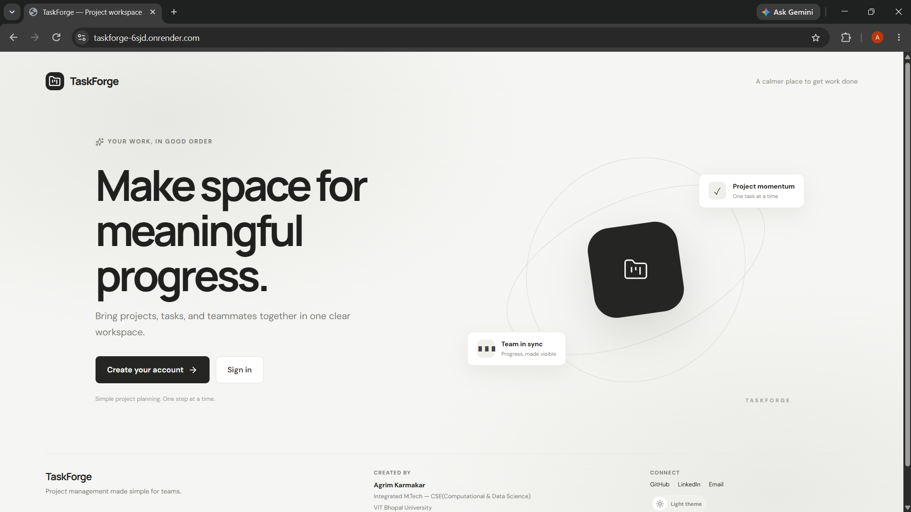
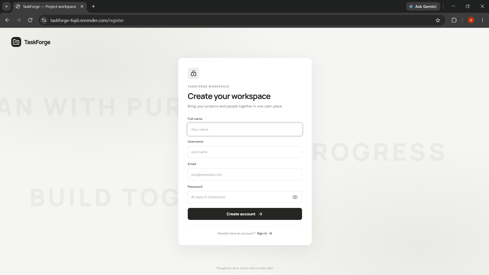
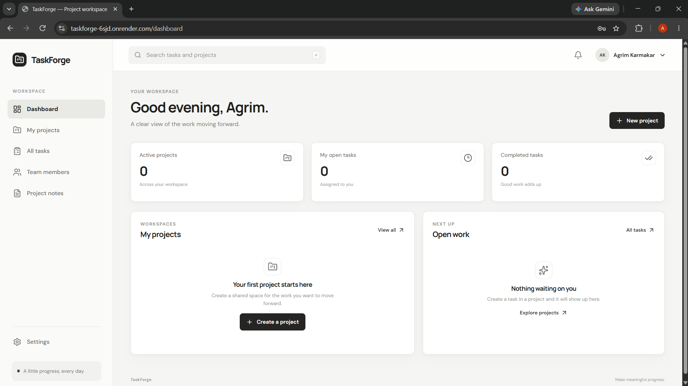
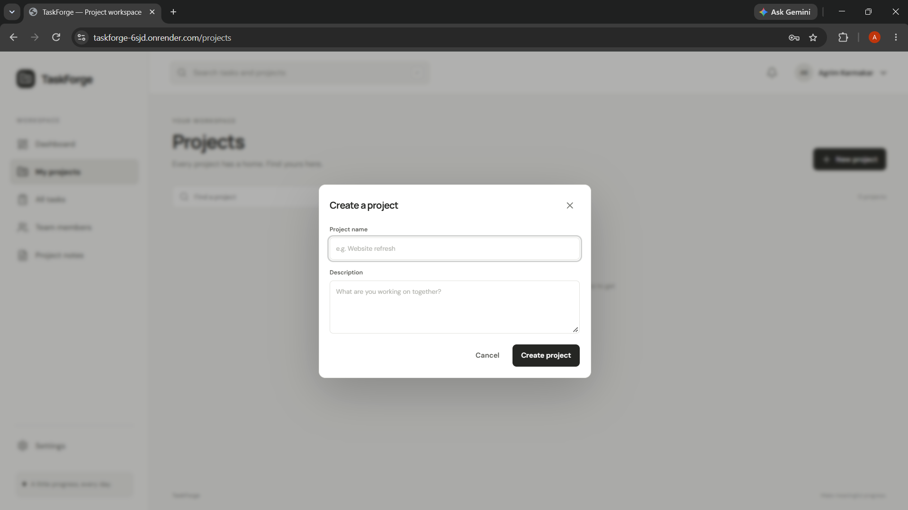

# TaskForge

TaskForge is a project management workspace for organizing projects, tasks, and teams.

- **Live app:** https://taskforge-6sjd.onrender.com
- **API health check:** https://taskforge-api-46zs.onrender.com/api/v1/healthCheck
- **API reference:** [docs/API.md](docs/API.md)

## Features

- Account registration, email verification, sign-in, and password recovery
- Projects with project-level Admin and Member roles
- Task assignment, due dates, status tracking, subtasks, and file attachments
- Project notes, workspace search, and notifications
- Responsive monochrome interface with light and dark themes
- REST API backed by MongoDB

## Screenshots

The screenshots below show the main path through the app: start at the landing page, create an account, arrive at the dashboard, then create a project to begin organizing work.

<table>
  <tr>
    <td align="center"><br><sub><strong>Landing page</strong> — entry point for creating an account or signing in.</sub></td>
    <td align="center"><br><sub><strong>Registration</strong> — create a TaskForge account.</sub></td>
  </tr>
  <tr>
    <td align="center"><br><sub><strong>Dashboard</strong> — overview of projects and open work.</sub></td>
    <td align="center"><br><sub><strong>Create a project</strong> — start a shared workspace with a name and description.</sub></td>
  </tr>
</table>

### Working through TaskForge

1. Visitors can create an account or sign in from the landing page.
2. After signing in, the dashboard summarizes the user's projects and tasks.
3. Create a project, then add team members, tasks, subtasks, notes, and attachments from the workspace.

## Technology

- **Frontend:** React, Vite, React Router, and Lucide
- **Backend:** Node.js, Express, and Mongoose
- **Database:** MongoDB
- **Email:** SMTP via Nodemailer and Mailgen
- **Hosting:** Render

## Run locally

Requirements: Node.js and access to a MongoDB database.

1. Clone this repository and install the backend dependencies:

   ```sh
   npm install
   ```

2. Copy `.env.example` to `.env` and fill in the values for your local setup. Never commit `.env` or share its secrets.

3. In one terminal, start the API:

   ```sh
   npm run dev
   ```

4. In a second terminal, install and start the frontend:

   ```sh
   npm --prefix frontend install
   npm run dev:frontend
   ```

5. Open http://localhost:5173. The Vite development server proxies API and image requests to the backend at http://localhost:8000.

To create a production frontend build, run `npm run build:frontend` from the repository root.

## Configuration

The backend reads the variables listed in `.env.example`. Set real values in your local `.env` or in your hosting provider's secret/environment settings. Do not place backend secrets in frontend variables.

For the deployed frontend, set `VITE_API_BASE_URL` to the API base URL, including `/api/v1`. Email verification and password recovery need working SMTP credentials and a correct `FRONTEND_BASE_URL`. Mailtrap Email Sandbox captures test messages; sending to arbitrary users requires a verified sending domain and sender.

## Deployment notes

The hosted demo runs on Render's `onrender.com` subdomains. Uploaded attachments are currently written to the backend's local `public/images` directory. Use persistent or object storage before relying on uploads for important or long-term data.

## License

No license has been added yet. Contact the author before reusing this code beyond GitHub's default viewing and forking permissions.
